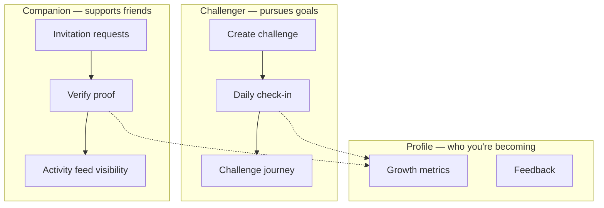

# HeroArc — Information Architecture

**Routes validated against:** [app/app/(tabs)/_layout.tsx](../../app/app/(tabs)/_layout.tsx)

---

## Top-level structure

```
App
├── Auth stack (unauthenticated)
│   ├── /welcome
│   ├── /login
│   ├── /signup
│   └── /signup-verify
├── Main tabs (authenticated) — default: Challenges
│   ├── /companion
│   ├── /challenges  ← initial route (PRD)
│   ├── /profile
│   └── /challenge/[id]  (hidden tab, nested stack)
└── Modal stack
    └── /challenge/create
```

---

## Tab bar

| Tab | Route | Icon metaphor | PRD section |
|-----|-------|---------------|-------------|
| Companion | `/(tabs)/companion` | People / handshake | Companion |
| Challenges | `/(tabs)/challenges` | Arc / sprout | Challenge (default) |
| Profile | `/(tabs)/profile` | Person / growth | My Profile |

**Visual weight:** Equal — three pillars of the product (Challenge · Companion · Profile).

**Active tint:** `forest-500` (not generic blue).

---

## Mental model



- **Challenger:** "I set a goal that matters. I show up daily. My friends see me."
- **Companion:** "My friend is growing. I help them stay honest — kindly."
- **Profile:** "Look how far I've come" — not a productivity dashboard.

---

## Screen hierarchy

### Challenges (home)

1. Greeting + emotional subline (time-aware optional V2)
2. Segmented filter: Active | Your journey
3. Create challenge FAB or header button
4. Challenge card list (infinite scroll)

### Challenge Journey

1. Collapsible challenge header (details component)
2. Progress trail + lives
3. Primary action (check-in / settle)
4. Activity feed (replaces chat in V1)

### Companion

1. Pending requests section (if any)
2. Segmented filter: Active | Your journey
3. Companion challenge cards

### Profile

1. Identity header (name, avatar)
2. Growth metrics grid (2×3)
3. Feedback form
4. Policies links
5. Log out

---

## UX improvements (no PRD logic change)

| Area | Before | After | Rationale |
|------|--------|-------|-----------|
| Past filter label | "Past" | "Your journey" | Identity framing |
| Create form | Single scroll | 3 steps: Basics → Companions → Stakes | Cognitive load |
| Challenge detail | "Chat" framing | "Journey" + activity feed | No chat in V1 |
| Reject action | Reject | Try again | Coach not judge |
| Profile title | "My Profile" | "Your growth" (header) | Emotional reward |

---

## Progressive disclosure — Create Challenge

| Step | Fields |
|------|--------|
| 1 — Basics | Name, start date, end date, daily deadline |
| 2 — Companions | Picker, invite SMS, max 10 |
| 3 — Stakes | Wager, lives (with helper: "Saves for busy days") |

---

## Navigation rules

- Opening app authenticated → Challenges tab (PRD US-1)
- Opening app unauthenticated → Welcome or Login
- Back from Journey → Challenges list (preserve filter)
- Create challenge → on success return to Challenges with new card
- Failed unsettled wagers stay in Active until settled (PRD US-6)

---

## Related

- [06-user-flows.md](./06-user-flows.md)
- [07-screens/](./07-screens/)
