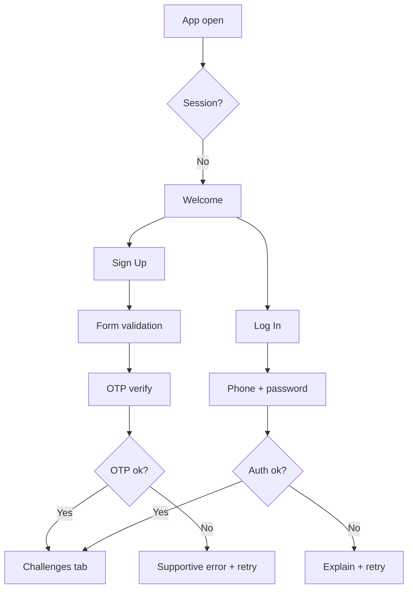
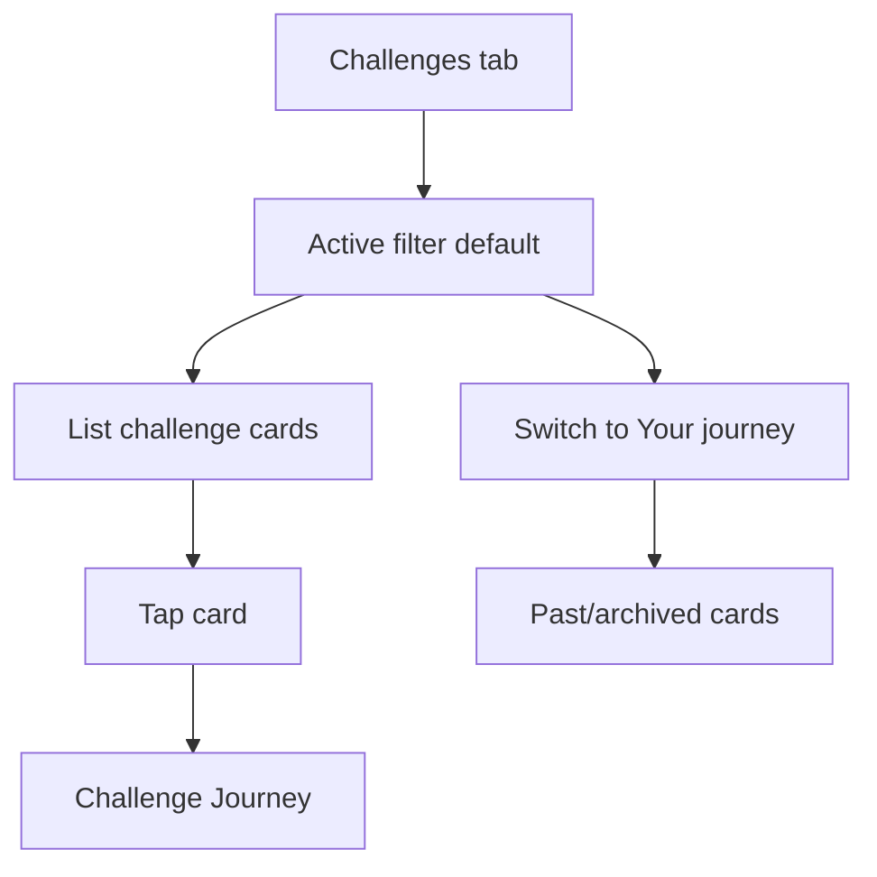
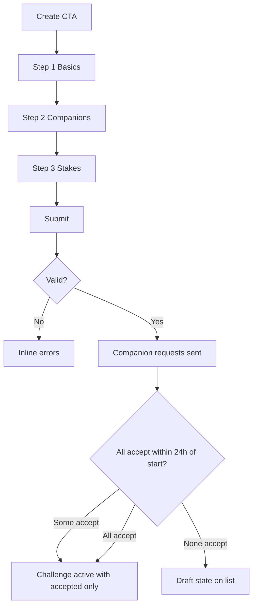
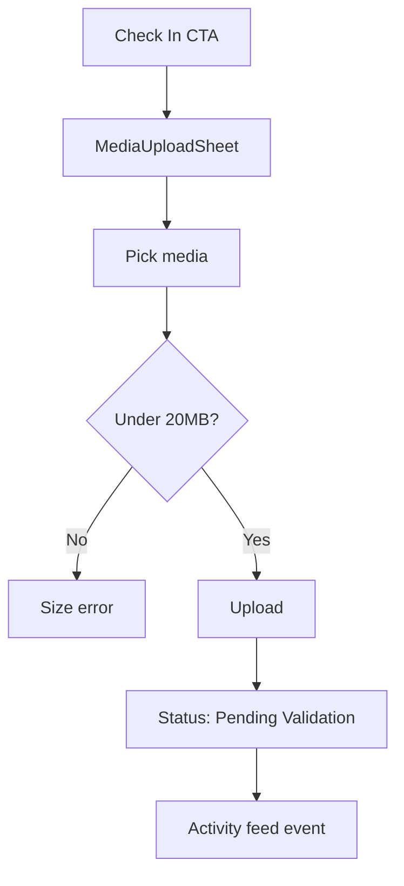
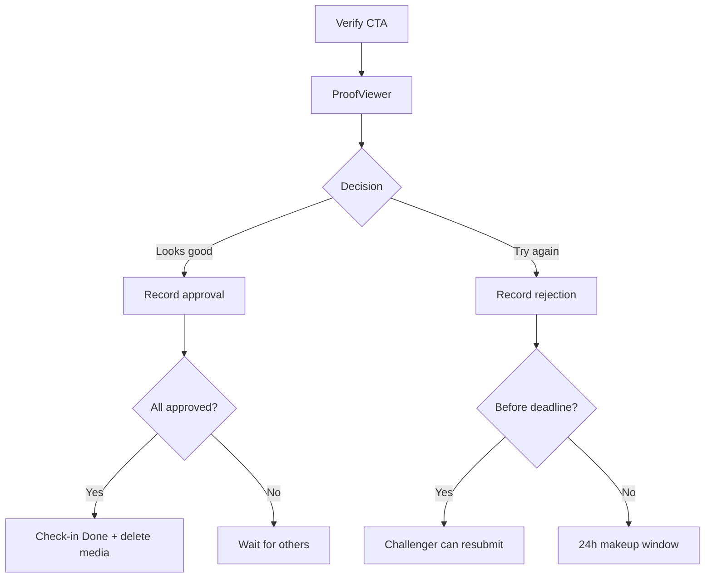
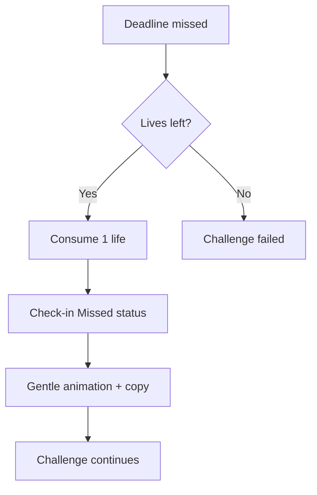
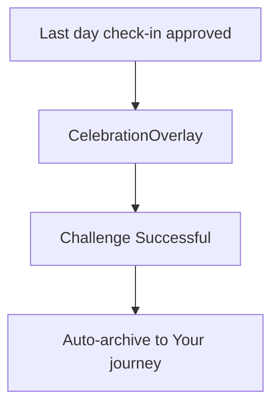
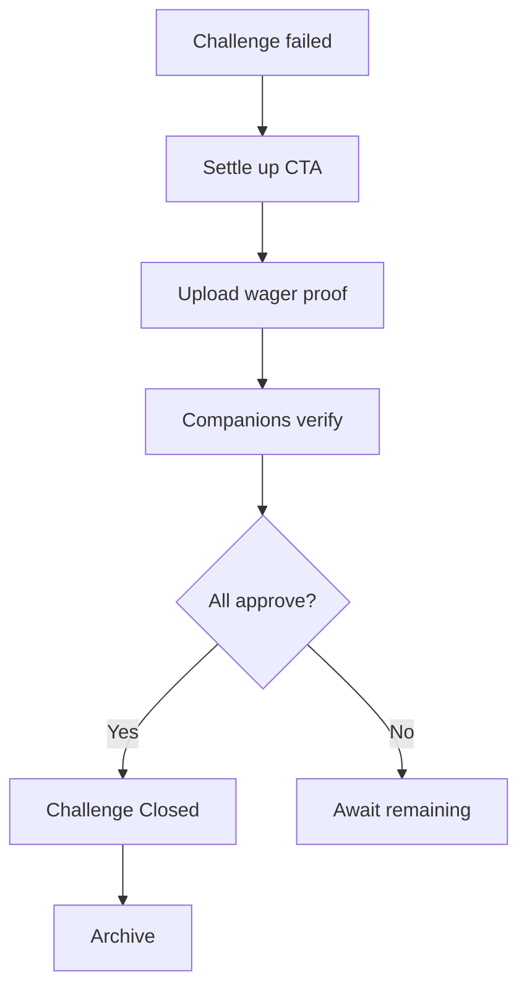
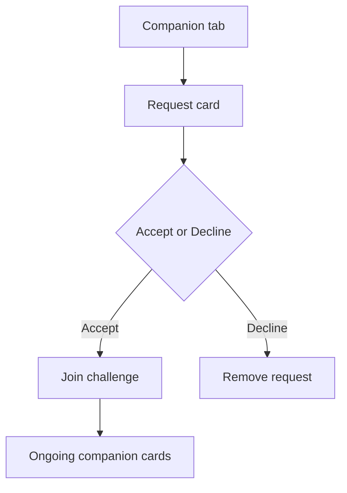
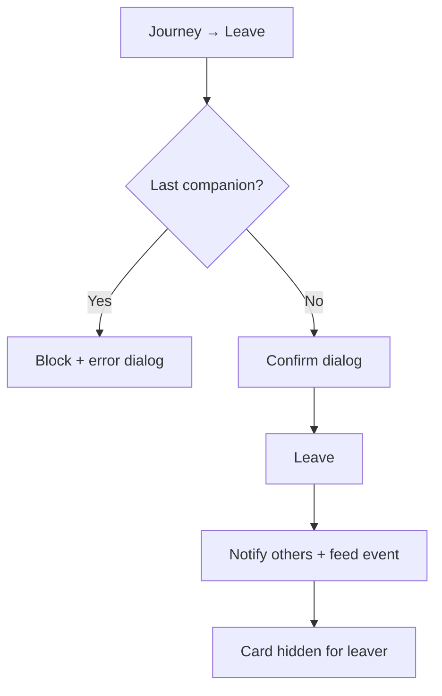

# HeroArc — User Flows

**PRD:** [Docs/PRD.md](../PRD.md) · **IA:** [05-information-architecture.md](./05-information-architecture.md)  
**Omitted:** US-4 (chat) — activity feed only in V1.

---

## Flow 1 — Onboarding (US-10, US-11)

**Edge cases:**
- Duplicate phone → redirect to login with warm copy
- OTP resend after 2 minutes
- OTP mismatch → option to edit signup details

---

## Flow 2 — View challenges (US-1)

**Edge cases:**
- Empty active → EmptyState + Create CTA
- Draft card → Edit challenge CTA

---

## Flow 3 — Create challenge (US-2)

**Validations:**
- Unique name among active challenges
- Max 5 active challenges → dialog
- Max 10 companion requests
- End date ≥ start + 7 days
- Lives < half duration
- At least 1 companion must eventually accept

---

## Flow 4 — Daily check-in (US-3)

**Entry points:** Challenge card CTA OR Journey header button.

**Rules:**
- Only before deadline (or makeup window)
- Cannot edit proof after submit
- Multiple media types allowed

---

## Flow 5 — Companion verification (US-9)

**Edge — delayed approval (PRD special case):**
- Deadline passes without all approvals → provisional advance to next day
- Later rejection → challenger owes 2 submissions (missed day + current day)

---

## Flow 6 — Life consumed

**Copy:** "Life happened — one save used" (never guilt).

---

## Flow 7 — Challenge success

Note: Success allowed even if lives were used during challenge (PRD).

---

## Flow 8 — Settle wager (US-6)

Failed challenges visible in Active until wager settled.

---

## Flow 9 — Companion invitation (US-7)

---

## Flow 10 — Leave challenge (US-8)

---

## Flow 11 — Profile (US-5)

View growth metrics, submit feedback (header + message → Google Sheet), open policies, log out.

---

## Notifications (reference)

Push registration: [app/src/lib/push.ts](../../app/src/lib/push.ts)

| Trigger | Audience |
|---------|----------|
| Check-in reminder | Challenger |
| Proof submitted | Companions |
| Verification complete | Challenger |
| Companion request | Companion |
| Companion left | Challenger + companions |
| Challenge success | All participants |

---

## Related

- [07-screens/](./07-screens/)
- [08-motion-prototype.md](./08-motion-prototype.md)
